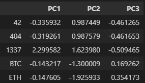
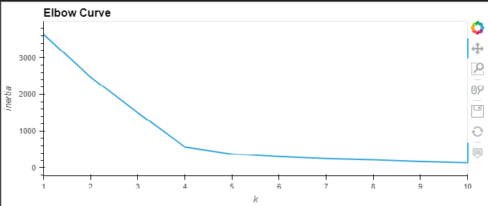
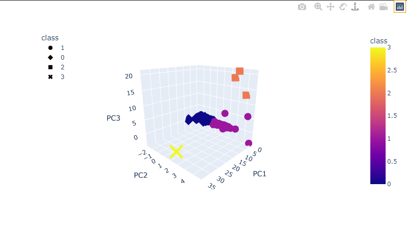
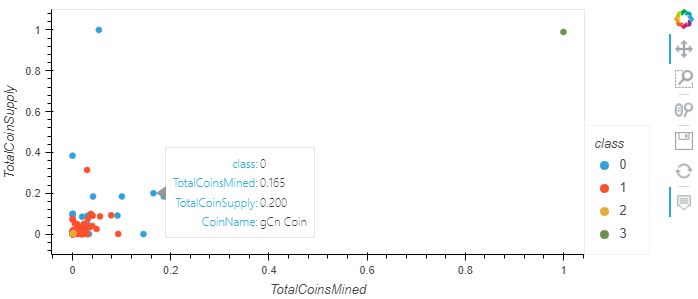
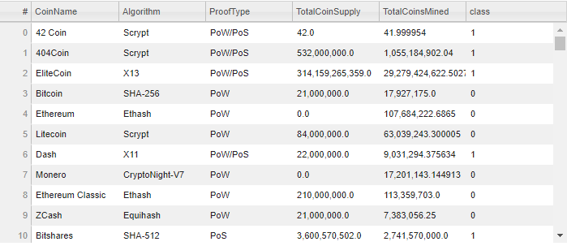

# Cryptocurrencies
Unsupervised Machine Learning

## Table of Contents
- [Overview of Project](#OverviewProject)
- [Results](#results)
  * [Preprocessing data](#preprocessing)
  * [Feature Elimination / Feature Extraction and PCA](#elimination)
  * [KMeans Clustering Unsupervised Algorithm](#clustering)
  * [Visualizations](#visualization)
- [Resources](#resources)
- [References](#references)

## Overview of Project

In this project we are analyzing the [Cryptocurrency data](crypto_data.csv) to discover trends that will convince an investment firm to invest in the new affordable cryptocurrencies. **Unsupervised learning** is the best way forward for this dataset because we are looking for any groupings, trends, or other information that could help us pitch cryptocurrencies to the investment firm.

My task is to create a report that includes the cryptocurrencies that are on the trading market and how they could be grouped to create a classification system for potential new investments in cryptocurrency.

## Results

Before we use unsupervised algorithm, we need to perform the below steps :
1. Preprocessing of the dataset.
2. Feature Elimination / Feature Extraction & Data Dimensions reduction using PCA.
3. Fit the unsupervised algorithm - KMeans on the data.
3. Visualizations - to visualize the clusters and groups generated by our algorithm.

###  Preprocessing data
The preproesing steps include the follwoing:
* **Check for null values** - In our datase I have dropped all rows containing null values.
* **Check for Duplicates** - In our dataset, there were no duplicate records, hence no rows were droppped.
* **Check the datatypes** - In our dataset , I checked the datatypes of all the columns. 
* **Label-Encoding** - I performed label encoding for non-numerical categorical columns. Unsupervised algorithm can handle only numerical data.
* **Scale the datatset** - The dataset needs to be scaled to get all the feature values on the same scale. Unscaled data leads to inaccurate results. In other words, data has been manipulated to ensure that the variance between the numbers won't skew results. We standardize these features by using the **StandardScaler** library. 

###  Feature Elimination / Feature Extraction and PCA
* **Feature Elimination** - We remove a good amount of features, so the model won't be run using every column. Too many features in a dataset, can lead to overfitting which inturn leads to inaccurate results. Hence in our dataset, we removed the columns like - "CoinName", "IsTrading". 
* **Feature Extraction** - This combines all features into a new set that is ordered by how well they predict our original variable.
* **Dimensionality Reduction - PCA** - The process of reducing features is called Dimensionality Reduction. PCA reduces the number of dimensions by transforming a large set of variables into a smaller one that contains most of the information in the original large set. We have perofrmed PCA on our dataset and reduced the number of features from ***98 coulmns to 3 columns***.

  
 

###  KMeans Clustering Unsupervised Algorithm
For the cryptocurrency dataset, I have used KMeans clustering algorithm frrom the Scikit Library.
 
**K-means** is an unsupervised learning algorithm used to identify and solve clustering issues. **K** represents how many clusters there will be. These clusters are then determined by the means of all the points that will belong to the cluster. The K-means algorithm groups the data into K clusters, where belonging to a cluster is based on some similarity or distance measure to a centroid.

The number of clusters is determined by the **Elbow Curve**. To create an elbow curve, we plot the clusters on the x-axis and the values of ***Inertia*** on the y-axis.The inertia is measuring the amount of variation in the dataset.

We get the below graph after plotting the data:

  
 

***From the above elbow curve, we can determine the Kvalue as 4 and execute the K-means unsupervised algorithm to cluster our data.***

###  Visualizations
Visualizing the clusters helps to graphically understand how they are arranged. For our visualizations, we have used hvPlot, a graphing library that allows deeper exploration of the data.
Below is a 3D-Scatter Plot with the PCA data and the clusters. We can see that the data is clustered into 4 main groups.

  
 
  
Below is a hvplot.scatter plot (2D-scatter plot) using x="TotalCoinsMined" and y="TotalCoinSupply". From the graph we can see a correlation between those two components.

  
 

Interactive Table:
We have also created an interactive table displaying the tradable cryptocurrencies and its details using ***hvplot library***. We can sort the data in the table for our analysis.

  
 

##  Resources
[1] [Cryptocurrency data](crypto_data.csv)  

[2] Software: 
* Python 3.10.2
* Visual Studio Code 1.64.2
* Jupyter Notebook

[3] Libraries:
* Scikit-learn
* Pandas
* Ploly

##  References
* The crypto_data.csv was retrieved from [CryptoCompare](https://min-api.cryptocompare.com/data/all/coinlist)
* [Handling Missing data](https://towardsdatascience.com/how-to-handle-missing-data-8646b18db0d4)
* [Eigen values and Eigen vectors](https://www.youtube.com/watch?v=PFDu9oVAE-g)

